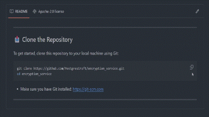
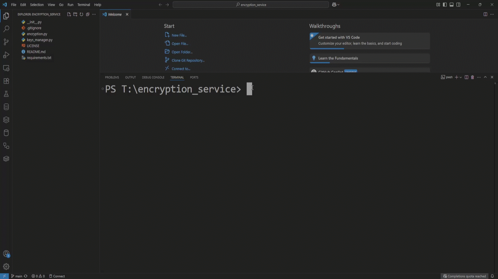
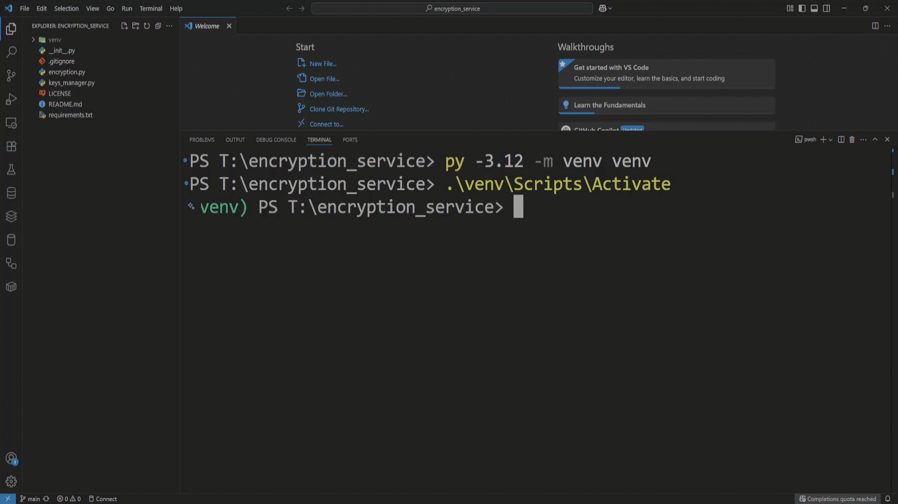
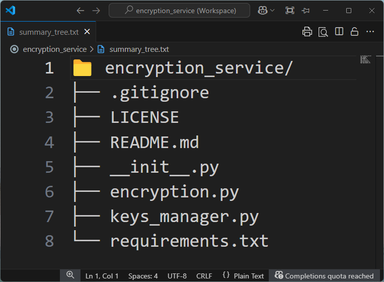

# Encryption Service 🔐

<p align="center">
  
  
</p>

A lightweight Python-based encryption and decryption tool built with the [`cryptography`](https://cryptography.io/en/latest/) library.  
Secure your sensitive data with ease through symmetric encryption, and manage your keys efficiently.

---

## 📚 Table of Contents

- 👨‍💻[Features](#features) 
- 📥[Clone the Repository](#clone-the-repository)
- 🚀[Quick Start](#quick-start)
- 🧱[Project Structure](#project-structure)
- 📄[License](#license)
- 👨‍💻[Author](#author)

---

## Features ✨

- 🔐 AES encryption and decryption (Fernet – symmetric key)
- 🔑 Key generation, saving, and loading
- 🧰 Easy CLI interface (coming soon)
- ⚙️ Ready for integration with PostgreSQL, APIs, or services
- 💻 Cross-platform (Windows, macOS, Linux)

[🔝 Back to Top](#encryption-service)

---

## Clone the Repository 📥

To get started, clone this repository to your local machine using Git:

```bash
git clone https://github.com/PostgresCraft/encryption_service.git
cd encryption_service
```

- Make sure you have Git installed: [https://git-scm.com](https://git-scm.com)

<p align="center">
  <a href="screenshots/Clone.gif">
    
  </a>
</p>
📽️ Quick Clone of the Encryption Service Tools in action

[🔝 Back to Top](#encryption-service)

---

## Quick Start 🚀

### 1. Create Virtual Environment

```bash
# Windows
py -3.12 -m venv venv
.\env\Scripts\Activate
```

<p align="center">
  <a href="screenshots/Windows.gif">
  
  </a>
</p>
📽️ Quick Windows of the Encryption Service Tools in action

[🔝 Back to Top](#encryption-service)

---

```bash
# macOS / Linux
python3 -m venv venv
source venv/bin/activate
```

---

### Optional: Upgrade pip (recommended)

Before installing dependencies, it's recommended to upgrade `pip` to the latest version to avoid compatibility issues.

```bash
python -m pip install --upgrade pip
```

<p align="center">
  <a href="screenshots/Upgradepip.gif">
  
  </a>
</p>
📽️ Upgrading pip on Windows (recommended)

[🔝 Back to Top](#encryption-service)

---

### Install Dependencies

```bash
pip install -r requirements.txt
```

<p align="center">
  <a href="screenshots/install.gif">
  
  </a>
</p>
📽️ Quick install of the Encryption Service Tools in action

[🔝 Back to Top](#encryption-service)

---

## Project Structure 🧱

The following is the current structure of the project files:

<p align="center">
  <a href="screenshots/summary_tree.png">
  
  </a>
</p>
📸 Project file structure overview

<details>
<summary>📄 Click to view the text version</summary>

```bash
encryption_service/
├── encryption.py           # Core encryption/decryption logic
├── keys_manager.py         # Key generation and key handling
├── requirements.txt        # List of dependencies
└── README.md               # Project documentation
```

</details>

[🔝 Back to Top](#encryption-service)

---

## License 📄

This project is licensed under the MIT License.  
See the [LICENSE](./LICENSE) file for details.

[🔝 Back to Top](#encryption-service)

---

## Author 👨‍💻

**Tamer Hamad Faour**  
GitHub: [@TamerOnLine](https://github.com/TamerOnLine)

[🔝 Back to Top](#encryption-service)

---