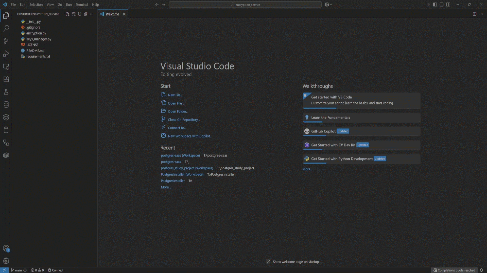

---

# 🔐 Encryption Service

A lightweight Python-based encryption and decryption tool built with the [`cryptography`](https://cryptography.io/en/latest/) library.  
Secure your sensitive data with ease through symmetric encryption, and manage your keys efficiently.


---

## ✨ Features

- 🔐 AES encryption and decryption (Fernet – symmetric key)
- 🔑 Key generation, saving, and loading
- 🧰 Easy CLI interface (coming soon)
- ⚙️ Ready for integration with PostgreSQL, APIs, or services
- 💻 Cross-platform (Windows, macOS, Linux)
---

## 📥 Clone the Repository

To get started, clone this repository to your local machine using Git:

```bash
git clone https://github.com/PostgresCraft/encryption_service.git
cd encryption_service
```

- Make sure you have Git installed: [https://git-scm.com](https://git-scm.com)

<div align="center">
  
</div>
<sub>📽️ Quick Clone of the Encryption Service Tools in action</sub>

---

## 🚀 Quick Start
### 1. Create Virtual Environment

```bash
# Windows
py -3.12 -m venv venv
.\venv\Scripts\Activate
```
<div align="center">
  
</div>
<sub>📽️ Quick Windows of the Encryption Service Tools in action</sub>

---

```bash
# macOS / Linux
python3 -m venv venv
source venv/bin/activate
```

---

### Install Dependencies

```bash
pip install -r requirements.txt
```
<div align="center">
  
</div>
<sub>📽️ Quick install of the Encryption Service Tools in action</sub>

---

## 📄 License

This project is licensed under the MIT License.  
See the [LICENSE](./LICENSE) file for details.

---

## 👨‍💻 Author

**Tamer Hamad Faour**  
GitHub: [@TamerOnLine](https://github.com/TamerOnLine)

---
